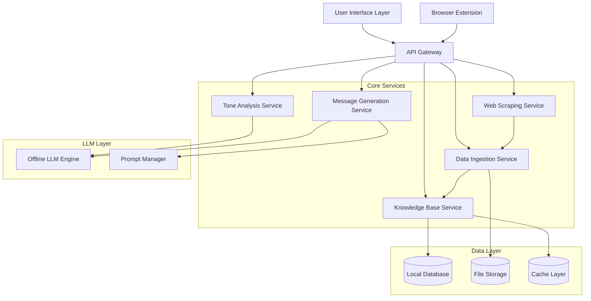

# Design Document: Offline LLM-Powered Hyper-Personalized Cold Outreach Engine

## Overview

The Offline LLM-Powered Hyper-Personalized Cold Outreach Engine is a privacy-first automation system that generates highly personalized outreach messages across multiple communication channels. The system leverages locally-hosted Large Language Models to analyze prospect data and generate tone-matched, channel-optimized messages without relying on external AI APIs.

The architecture follows a modular design with clear separation between data ingestion, analysis, generation, and storage components. The system prioritizes privacy, performance, and personalization quality while maintaining the flexibility to support various offline LLM models and communication channels.

## Architecture

The system follows a layered architecture with the following key components:



**Key Architectural Principles:**
- **Privacy-First**: All processing happens locally with no external API dependencies for core functionality
- **Scraping-Enabled**: Built-in web scraping capabilities for LinkedIn and social media data collection
- **Modular Design**: Each service has a single responsibility and clear interfaces
- **Offline-Capable**: Core functionality works without internet connectivity (after data collection)
- **Extensible**: Support for multiple LLM models and communication channels
- **Performance-Optimized**: Caching and batch processing for scalability
- **Stealth Scraping**: Rate-limited, rotating scraping to avoid detection

## Components and Interfaces

### Data Ingestion Service

**Responsibility**: Process and normalize prospect data from various sources including web scraping

**Key Methods**:
```python
class DataIngestionService:
    def scrape_linkedin_profile(self, profile_url: str) -> ProspectProfile
    def scrape_social_media_posts(self, profile_urls: dict) -> SocialMediaProfile
    def ingest_linkedin_profile(self, profile_data: dict) -> ProspectProfile
    def ingest_social_media_data(self, social_data: dict) -> SocialMediaProfile
    def merge_prospect_data(self, profiles: List[ProspectProfile]) -> ProspectProfile
    def validate_data_quality(self, profile: ProspectProfile) -> ValidationResult
    def batch_scrape_prospects(self, urls: List[str]) -> List[ProspectProfile]
```

**Input Sources**:
- **Web Scraping**: LinkedIn profiles, Twitter/X posts, company websites (using Selenium/Playwright)
- **File Imports**: LinkedIn profile exports (JSON/CSV), social media content (text files)
- **Manual Entry**: Web form for direct data input
- **Batch Import**: CSV/JSON files with prospect lists
- **Browser Extensions**: Chrome/Firefox extensions for one-click profile capture

**Scraping Implementation**:
- **LinkedIn Scraper**: Uses Selenium with stealth mode to extract public profile information
- **Social Media Scraper**: Collects recent posts and engagement data from public profiles
- **Rate Limiting**: Implements delays and rotation to avoid detection
- **Data Validation**: Ensures scraped data meets quality standards before processing
- **Error Handling**: Graceful fallback when profiles are private or unavailable

**Output**: Normalized `ProspectProfile` objects stored in Knowledge Base

### Web Scraping Service

**Responsibility**: Extract prospect data from public web sources using automated scraping

**Key Methods**:
```python
class WebScrapingService:
    def scrape_linkedin_profile(self, profile_url: str) -> LinkedInProfile
    def scrape_twitter_posts(self, username: str, post_count: int = 10) -> List[TwitterPost]
    def scrape_company_about_page(self, company_url: str) -> CompanyInfo
    def batch_scrape_profiles(self, urls: List[str]) -> List[ScrapedProfile]
    def validate_scraping_permissions(self, url: str) -> bool
    def rotate_scraping_session(self) -> None
```

**Scraping Capabilities**:
- **LinkedIn Profiles**: Name, role, company, location, about section, recent activity
- **Twitter/X Posts**: Recent tweets, engagement patterns, communication style
- **Company Websites**: About pages, news, recent updates
- **GitHub Profiles**: For technical prospects - repositories, activity, languages

**Anti-Detection Features**:
- User-agent rotation and browser fingerprint randomization
- Configurable delays between requests (2-10 seconds)
- Proxy rotation support for large-scale scraping
- Session management with cookie persistence
- CAPTCHA detection and manual intervention prompts

**Privacy and Ethics**:
- Only scrapes publicly available information
- Respects robots.txt and rate limiting
- Provides opt-out mechanisms for prospects
- Logs all scraping activities for audit purposes

### Tone Analysis Service

**Responsibility**: Analyze communication patterns and infer preferred tone/style

**Key Methods**:
```python
class ToneAnalysisService:
    def analyze_communication_style(self, content: List[str]) -> CommunicationStyle
    def detect_language_patterns(self, content: str) -> LanguagePatterns
    def classify_formality_level(self, content: str) -> FormalityLevel
    def extract_vocabulary_preferences(self, content: str) -> VocabularyProfile
```

**Analysis Dimensions**:
- Formality: Formal, Professional, Casual, Conversational
- Language: Technical, Business, Creative, Academic
- Tone: Friendly, Direct, Enthusiastic, Conservative
- Structure: Concise, Detailed, Bullet-point, Narrative

### Message Generation Service

**Responsibility**: Generate personalized messages for each communication channel

**Key Methods**:
```python
class MessageGenerationService:
    def generate_multi_channel_messages(self, prospect: ProspectProfile) -> ChannelMessages
    def generate_email_message(self, prospect: ProspectProfile, template: Template) -> EmailMessage
    def generate_social_message(self, prospect: ProspectProfile, channel: Channel) -> SocialMessage
    def apply_personalization(self, template: str, prospect: ProspectProfile) -> str
    def optimize_for_channel(self, message: str, channel: Channel) -> str
```

**Channel Specifications**:
- **Email**: 150-300 words, subject line, professional formatting
- **LinkedIn DM**: 100-200 words, professional tone, connection context
- **WhatsApp**: 50-100 words, casual tone, emoji support
- **SMS**: 25-50 words, ultra-concise, clear CTA
- **Instagram DM**: 75-150 words, visual-friendly, casual tone

### Knowledge Base Service

**Responsibility**: Manage prospect data, outreach history, and learning insights

**Key Methods**:
```python
class KnowledgeBaseService:
    def store_prospect(self, prospect: ProspectProfile) -> str
    def retrieve_prospect(self, prospect_id: str) -> ProspectProfile
    def search_prospects(self, criteria: SearchCriteria) -> List[ProspectProfile]
    def store_outreach_history(self, history: OutreachHistory) -> None
    def get_success_patterns(self, segment: ProspectSegment) -> SuccessPatterns
    def prevent_duplicate_outreach(self, prospect_id: str, channel: Channel) -> bool
```

**Data Models**:
- ProspectProfile: Core prospect information and preferences
- OutreachHistory: Message history, responses, success metrics
- CommunicationStyle: Tone analysis results and preferences
- SuccessPatterns: Learned insights for prospect segments

### Offline LLM Engine

**Responsibility**: Interface with locally-hosted language models for text generation

**Key Methods**:
```python
class OfflineLLMEngine:
    def initialize_model(self, model_path: str, config: ModelConfig) -> bool
    def generate_text(self, prompt: str, parameters: GenerationParams) -> str
    def batch_generate(self, prompts: List[str]) -> List[str]
    def get_model_info(self) -> ModelInfo
    def health_check(self) -> HealthStatus
```

**Supported Models**:
- LLaMA 2/3 (7B, 13B, 70B variants)
- Mistral 7B/8x7B
- Gemma 2B/7B
- Code Llama (for technical prospects)
- Custom fine-tuned models

**Model Selection Strategy**:
- Default: Mistral 7B (balanced performance/quality)
- High-quality: LLaMA 70B (when resources allow)
- Fast generation: Gemma 2B (for batch processing)
- Technical prospects: Code Llama (for developer outreach)

## Data Models

### ProspectProfile
```python
@dataclass
class ProspectProfile:
    id: str
    name: str
    email: Optional[str]
    company: str
    role: str
    industry: str
    location: str
    linkedin_url: Optional[str]
    interests: List[str]
    recent_activity: List[ActivityItem]
    communication_style: CommunicationStyle
    contact_preferences: ContactPreferences
    created_at: datetime
    updated_at: datetime
```

### CommunicationStyle
```python
@dataclass
class CommunicationStyle:
    formality_level: FormalityLevel  # FORMAL, PROFESSIONAL, CASUAL, CONVERSATIONAL
    language_type: LanguageType      # TECHNICAL, BUSINESS, CREATIVE, ACADEMIC
    tone_preference: ToneType        # FRIENDLY, DIRECT, ENTHUSIASTIC, CONSERVATIVE
    message_structure: StructureType # CONCISE, DETAILED, BULLET_POINT, NARRATIVE
    vocabulary_complexity: ComplexityLevel # SIMPLE, MODERATE, ADVANCED
    confidence_score: float          # 0.0-1.0 based on analysis quality
```

### ChannelMessages
```python
@dataclass
class ChannelMessages:
    prospect_id: str
    generated_at: datetime
    email: EmailMessage
    linkedin_dm: LinkedInMessage
    whatsapp: WhatsAppMessage
    sms: SMSMessage
    instagram_dm: InstagramMessage
    generation_metadata: GenerationMetadata
```

### ScrapedProfile
```python
@dataclass
class ScrapedProfile:
    source_url: str
    scraped_at: datetime
    profile_data: dict
    scraping_success: bool
    error_message: Optional[str]
    data_quality_score: float  # 0.0-1.0 based on completeness
    rate_limit_hit: bool
    requires_manual_review: bool
```

### OutreachHistory
```python
@dataclass
class OutreachHistory:
    prospect_id: str
    channel: Channel
    message_content: str
    sent_at: datetime
    response_received: bool
    response_time: Optional[timedelta]
    conversion_achieved: bool
    success_score: float
    feedback_notes: Optional[str]
```

## Error Handling

The system implements comprehensive error handling across all components:

**Data Ingestion Errors**:
- Invalid data format: Log error, skip invalid records, continue processing
- Missing required fields: Flag as incomplete, store partial data with warnings
- Duplicate prospects: Merge data intelligently, prefer newer information

**LLM Integration Errors**:
- Model unavailable: Graceful degradation with cached templates
- Generation timeout: Retry with simplified prompts, fallback to templates
- Invalid model output: Sanitize content, retry with different parameters

**Knowledge Base Errors**:
- Database connection issues: Use local cache, queue operations for retry
- Storage capacity limits: Implement data archiving and cleanup policies
- Concurrent access conflicts: Use optimistic locking with retry logic

**Message Generation Errors**:
- Personalization failures: Fall back to semi-personalized templates
- Channel constraint violations: Auto-truncate with preserved key information
- Quality validation failures: Regenerate with adjusted parameters

## Testing Strategy

The testing strategy employs a dual approach combining unit tests for specific functionality and property-based tests for comprehensive validation.

**Unit Testing Focus**:
- Data ingestion edge cases (malformed inputs, missing fields)
- LLM integration error scenarios (timeouts, invalid responses)
- Channel-specific message formatting and constraints
- Knowledge base CRUD operations and search functionality
- User interface interactions and validation

**Property-Based Testing Focus**:
- Message generation consistency across multiple runs
- Personalization quality maintenance across prospect variations
- Channel constraint compliance for all generated content
- Data integrity preservation through ingestion and storage cycles
- Performance characteristics under varying load conditions

**Testing Configuration**:
- Property tests: Minimum 100 iterations using Hypothesis (Python) or fast-check (TypeScript)
- Each property test references specific design properties
- Integration tests validate end-to-end workflows
- Performance tests ensure sub-30-second generation times
- Mock data generators create realistic prospect profiles for testing

**Test Data Strategy**:
- Synthetic prospect profiles covering diverse industries and roles
- Mock social media content representing different communication styles
- Anonymized real-world examples (with explicit permission)
- Edge case scenarios (minimal data, conflicting information)
- Performance test datasets (100+ prospects for batch operations)

## Correctness Properties

*A property is a characteristic or behavior that should hold true across all valid executions of a system—essentially, a formal statement about what the system should do. Properties serve as the bridge between human-readable specifications and machine-verifiable correctness guarantees.*

### Property 1: Data Extraction Completeness
*For any* valid LinkedIn profile data, the system should extract all available role, company, industry, and interests information without data loss
**Validates: Requirements 1.1**

### Property 2: Data Merging Consistency  
*For any* set of overlapping prospect data from multiple sources, merging should produce a single consistent profile that preserves all unique information
**Validates: Requirements 1.3**

### Property 3: Graceful Error Handling
*For any* invalid or incomplete prospect data, the system should flag missing fields, continue processing with available data, and maintain system stability
**Validates: Requirements 1.4**

### Property 4: Comprehensive Data Persistence
*For any* processed prospect profile, communication style analysis, and outreach history, all data should be stored in the Knowledge Base and retrievable for future reference
**Validates: Requirements 1.5, 2.4, 5.1**

### Property 5: Communication Style Classification
*For any* prospect content sample, the tone analyzer should classify communication style into one of the defined categories (formal, casual, professional, conversational) with consistent criteria
**Validates: Requirements 2.1**

### Property 6: Default Tone Fallback
*For any* prospect with insufficient communication samples, the system should default to professional tone with industry-appropriate language
**Validates: Requirements 2.3**

### Property 7: Multi-Channel Message Generation
*For any* prospect profile, the message generator should create content for all five channels (Email, WhatsApp, SMS, LinkedIn DM, Instagram DM) with appropriate formatting
**Validates: Requirements 3.1**

### Property 8: Channel Constraint Compliance
*For any* generated message, the content should respect channel-specific length limits, format requirements, and include a clear call-to-action
**Validates: Requirements 3.2, 3.4**

### Property 9: Comprehensive Personalization
*For any* prospect with available profile data, generated messages should include specific references to role, company, recent activity, and relevant interests
**Validates: Requirements 3.3, 4.1**

### Property 10: Offline Operation Guarantee
*For any* message generation request, the system should complete processing using only locally-hosted LLM without external API calls
**Validates: Requirements 3.5, 6.1, 6.3**

### Property 11: Tone Matching Consistency
*For any* prospect with identified communication style, generated messages should mirror the prospect's tone and language preferences
**Validates: Requirements 4.2**

### Property 12: Content Quality Standards
*For any* generated message, the content should avoid generic corporate language patterns and AI-generated text markers
**Validates: Requirements 4.3**

### Property 13: Message Variation Maintenance
*For any* prospect requiring multiple messages, each message should use different approaches while maintaining consistent personalization quality
**Validates: Requirements 4.5**

### Property 14: Duplicate Prevention
*For any* prospect-channel combination, the system should prevent duplicate message generation within the configured time period
**Validates: Requirements 5.4**

### Property 15: Model Compatibility
*For any* supported offline LLM model (LLaMA, Mistral, Gemma), the system should initialize successfully and generate coherent messages
**Validates: Requirements 6.4**

### Property 16: LLM Availability Handling
*For any* scenario where the offline LLM becomes unavailable, the system should provide clear error messages and graceful degradation
**Validates: Requirements 6.5**

### Property 17: Data Privacy Compliance
*For any* prospect data processing operation, the system should handle only publicly available or explicitly provided mock data with local encryption for sensitive information
**Validates: Requirements 8.1, 8.2**

### Property 18: Audit Trail Completeness
*For any* data access or processing activity, the system should create comprehensive audit log entries for compliance tracking
**Validates: Requirements 8.5**

### Property 19: Batch Processing Performance
*For any* batch of up to 100 prospects, the system should complete processing without performance degradation or memory issues
**Validates: Requirements 9.1**

### Property 20: Response Time Guarantee
*For any* single prospect message generation request, the system should complete processing within 30 seconds
**Validates: Requirements 9.2**

### Property 21: Database Query Performance
*For any* Knowledge Base query on databases up to 10,000 prospects, the system should return results within 2 seconds
**Validates: Requirements 9.4**

### Property 22: Configuration Parameter Effects
*For any* adjustment to creativity, formality, or length settings, the generated messages should reflect the parameter changes consistently
**Validates: Requirements 10.2**

### Property 23: Template Customization Application
*For any* customized message template for a specific channel, all generated messages for that channel should incorporate the template modifications
**Validates: Requirements 10.1**